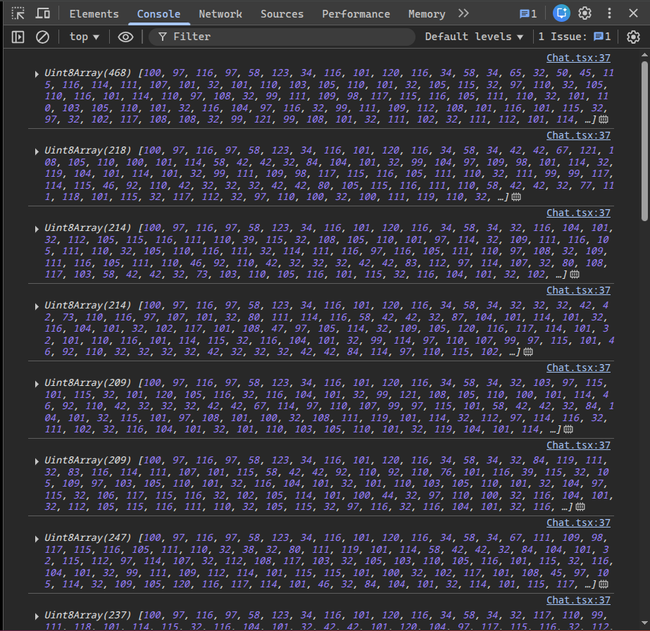
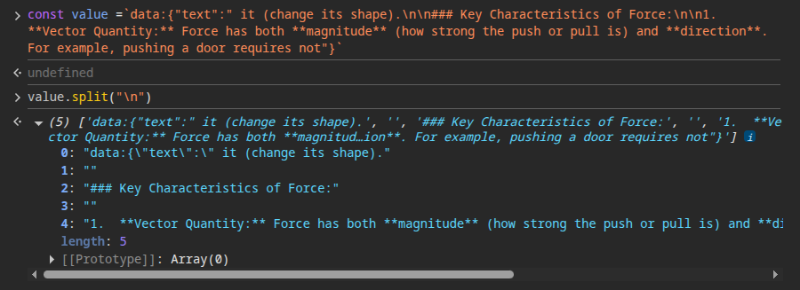

# Ai Chat App

- Integate google gemini api

**Server Side events**

- https://javascript.info/server-sent-events

- The client has to send `GET` `Content-type: text/event-stream` header
- The response is of header `text/event-stream` & `Transfer-encoding:chunked`
- "data:" -> event must start with `data:`
- "\n\n" -> SSE messages must be separated by a blank line.

- SSE to work first the browser has to send initial req to server, doing the handshake
- The connection created by http event stream is timedout
  - by proxy layer, if there is not response from the server the default behaviour of proxy is to close the connection

- use cases
  - youtube live chat
  - showing progress
  - logging

---

- raw binary byte level data
- Those numbers you're seeing (97, 116, 101, 120, 116, 58, 32, 123, ...) are ASCII/UTF-8 byte values of the incoming text chunks.
